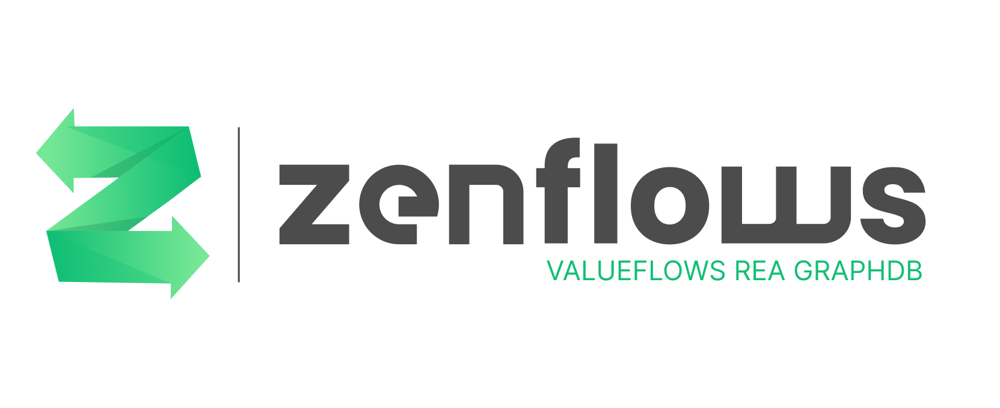

# Zenflows - Valueflows REA GraphDB

Zenflows is a tool to leverage commons-based peer production by
documenting and monitoring the life cycle of products. The goal is
that of enabling a federated network of organizations to bundle,
systematize and share data, information and knowledge about physical
artifacts.

## Features

- Most validations are provable (and sealed by means of cryptography) using [Zenroom](https://zenroom.org) as core crypto component, including support for advanced Digital Product Passport schemes like
[REFLOW Portable Crypto Functions](https://medium.com/think-do-tank/reflow-crypto-material-passports-for-the-circular-economy-d75b3aa63678).

- The [Valueflows](https://valueflo.ws) vocabulary is adopted to govern a [Resource Event Agent](https://en.wikipedia.org/wiki/Resources,_Events,_Agents) accounting model and facilitate the development and execution of business logics built on top of it.

- The [PosgreSQL](https://postgresql.org) database backend is used as battle-tested data-storage solution well compatible with established enterprise standards in system administration, on top of it a GraphQL interface is developed based on the well performant [Elixir](https://elixir-lang.org) language framework.

Zenflows is a software component of the [INTERFACER project](https://www.interfacerproject.eu).

<h4 align="center">
  <a href="#-quick-start">🎮 Quick start</a>
   • 
  <a href="#-install">💾 Install</a>
   • 
  <a href="#-configuration">🔧 Configuration</a>
   • 
  <a href="#-testing">📋 Testing</a>
   • 
  <a href="#-styleguide">📘 Styleguide</a>
   • 
  <a href="#-troubleshooting--debugging">🐛 Troubleshooting & debugging</a>
   • 
  <a href="#-acknowledgements">😍 Acknowledgements</a>
   • 
  <a href="#-links">🌐 Links</a>
   • 
  <a href="#-contributing">👤 Contributing</a>
   • 
  <a href="#-license">💼 License</a>
</h4>

 
<strong>🚩 Table of Contents</strong> (click to expand)

* [Quick start](#-quick-start)
* [Install](#-install)
* [Configuration](#-configuration)
* [Testing](#-testing)
* [Styleguide](#-styleguide)
* [Troubleshooting & debugging](#-troubleshooting--debugging)
* [Acknowledgements](#-acknowledgements)
* [Links](#-links)
* [Contributing](#-contributing)
* [License](#-license)

## 🎮 Quick start

To start using Zenflows with native-to-host Elixir, PostgreSQL, and Restroom instances:

1. Run `./mann env.setup` to generate the configuration file, `conf/env.sh`.
2. Edit `conf/env.sh` to suit your needs.  Read the [Configuration Guide](docs/configuration-guide.md) for more info.
3. Run `./mann db.setup` to setup the database and run the migrations.
4. Run `./mann serve` to start the application.
5. Head over to [`localhost:4000/play`](http://localhost:4000/play) for the GraphiQL playground.
6. Use the URL `http://localhost:4000/api` in case if you'd like to use your own GraphQL client.

To start using Zenflows with docker(-compose):

1. Run `./mann devop.serve`.  This will create the necessary docker-compose file and fill in the secrets.
2. When the iex (elixir shell) comes up, just type `Zenflows.Reltask.migrate()` and hit enter to migrate the database.

Optionally, you can run `./mann devop.setup` before running `./mann devop.serve` to generate the docker-compose file, and edit it to suit your needs.

**[🔝 back to top](#toc)**

***
## 💾 Install

🚧 TODO

**[🔝 back to top](#toc)**

***
## 🔧 Configuration

🚧 TODO

**[🔝 back to top](#toc)**

***

## 📋 Testing

🚧 TODO

**[🔝 back to top](#toc)**

***
## 📘 Styleguide

* Use tabs for indentation, spaces for aligment.
* Don't indent the top-level code in modules.
* Use trailing commas in multi-line lists, maps, functions, etc. where
  possible.

**[🔝 back to top](#toc)**

***
## 🐛 Troubleshooting & debugging

🚧 TODO

**[🔝 back to top](#toc)**

***
## 😍 Acknowledgements

Copyleft (ɔ) 2021-2022 by [Dyne.org](https://www.dyne.org) foundation, Amsterdam

Designed, written and maintained by [srfsh](https://github.com/srfsh) with the help of [jaromil](https://github.com/jaromil), [puria](https://github.com/puria).

Reviews and suggestions contributed by [Lynn](https://github.com/fosterlynn), [Bob](https://github.com/bhaugen), and members of the Valueflows community.

This project is receiving funding from the European Regional Development Fund (ERDF).

**[🔝 back to top](#toc)**

***
## 🌐 Links

https://interfacerproject.eu

https://dyne.org/

https://reflowproject.eu

https://www.valueflo.ws/

**[🔝 back to top](#toc)**

***
## 👤 Contributing

Please first take a look at the
[Dyne.org - Contributor License Agreement](CONTRIBUTING.md) then

1.  🔀 [FORK IT](../../fork)
2.  Create your feature branch `git checkout -b feat/branch`
3.  Commit your changes `git commit -am 'Add some fooBar'`
4.  Push to the branch `git push origin feature/branch`
5.  Create a new Pull Request `gh pr create -f`
6.  🙏 Thank you

**[🔝 back to top](#toc)**

***
## 💼 License
    Zenflows - Valueflows vocabulary
    Copyright (c) 2021-2022 Dyne.org foundation, Amsterdam

    This program is free software: you can redistribute it and/or modify
    it under the terms of the GNU Affero General Public License as
    published by the Free Software Foundation, either version 3 of the
    License, or (at your option) any later version.

    This program is distributed in the hope that it will be useful,
    but WITHOUT ANY WARRANTY; without even the implied warranty of
    MERCHANTABILITY or FITNESS FOR A PARTICULAR PURPOSE.  See the
    GNU Affero General Public License for more details.

    You should have received a copy of the GNU Affero General Public License
    along with this program.  If not, see <http://www.gnu.org/licenses/>.

**[🔝 back to top](#toc)**
