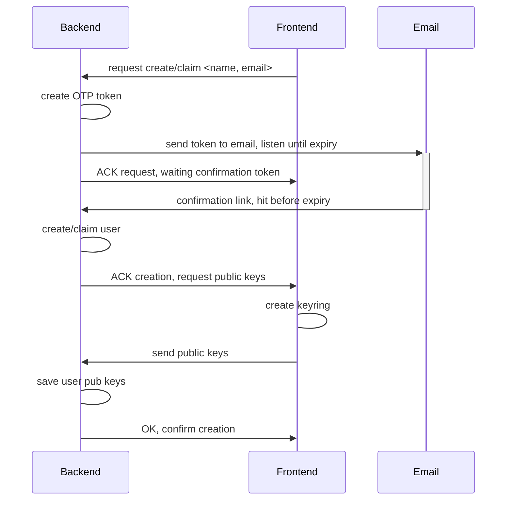

# Technical documentation on User Creation

This document details user creation in Zenflows.

The basic principle is end-to-end encryption: secret keys are not held by the server backend, but created on the frontend side.

