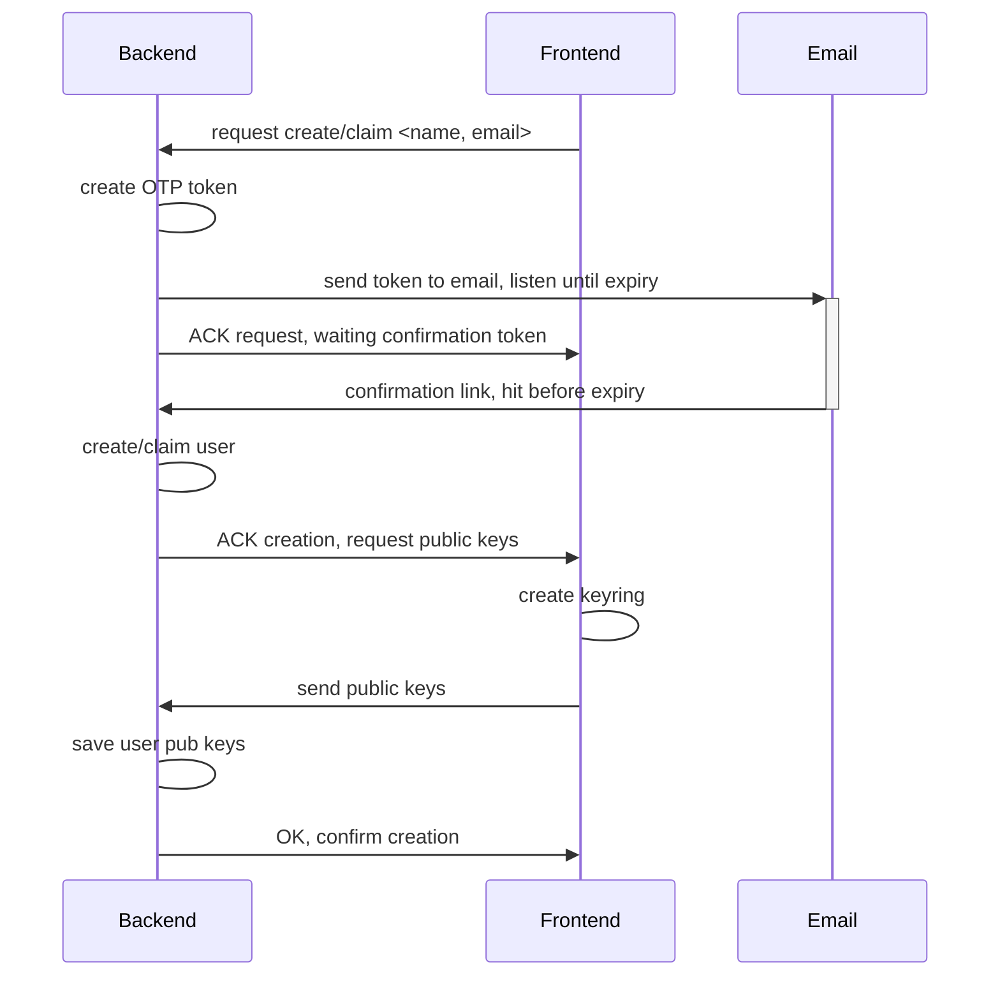

# Technical documentation on User Creation

This document details user creation in Zenflows.

The basic principle is end-to-end encryption: secret keys are not held by the server backend, but created on the frontend side.



## User create/claim

User **creation** should create a new corresponding Agent in Valueflows (User and Agent coincide)

User **claiming** should happen if an **Agent with the same Email** already exists in the database, then the Agent is filled with the new information from this process (public keys, name, etc.) and becomes valid for login.

## Public keys

The public keys are created in the [keygen.zen](zencode/src/keygen.zen) script and they are structured as follows:

```
            ethereum_address = octet[20] ,
            pubkeys = {
                ecdh_public_key = octet[65] ,
                eddsa_public_key = octet[32] ,
                reflow_public_key = ecp2[192] ,
                schnorr_public_key = octet[48]
            }
```

They values stated above are specifying their binary format in Zenroom, however both the Frontend and the Backend do not need to decode them and access them in binary format, all they need to do is to save them as encoded strings, each in their own respecting encoding (most base64, some hex).
